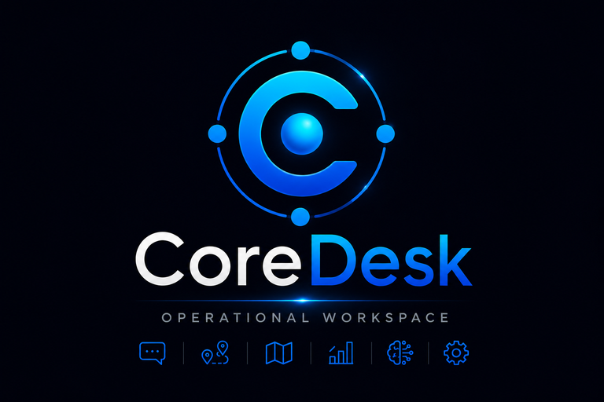

# CoreDesk



Workspace operacional desktop com Electron, React, TypeScript, Vite, Tailwind CSS e Zustand. O CoreDesk reúne módulos internos, navegação web e múltiplas sessões isoladas do WhatsApp Web na mesma janela.

## Requisitos

- Node.js 20.19 ou superior
- npm 10 ou superior

## Instalação e desenvolvimento

```bash
npm install
npm run assets:generate
npm run dev
```

Alterações no renderer têm atualização rápida. Alterações em `electron/` exigem reiniciar o processo de desenvolvimento.

## Qualidade e distribuição

```bash
npm run lint
npm run typecheck
npm test
npm run build
npm run dist
npm audit
npm audit --omit=dev
```

Os artefatos são gravados em `dist/`, `dist-electron/` e `release/`.

## Arquitetura

- `electron/WebViewManager.ts`: proprietário único de todas as `WebContentsView`.
- `electron/whatsapp/WhatsAppProfileManager.ts`: operações de domínio, sessões, ícones e estado dos perfis.
- `electron/whatsapp/WhatsAppProfileStore.ts`: armazenamento JSON atômico de metadados no diretório de dados da aplicação.
- `electron/preload.ts`: API mínima e tipada exposta por `contextBridge`.
- `shared/`: contratos IPC, modelo de perfis, validações e dimensões do shell.
- `src/`: interface React, stores, sidebar, Comunicação e controles.

Fechar uma aba de WhatsApp não encerra sua view. A mesma `WebContentsView` permanece viva e é recolocada ao abrir o perfil pela sidebar. A view só é destruída ao remover o perfil, limpar sua sessão ou encerrar o aplicativo.

## Perfis do WhatsApp

Cada perfil recebe um UUID e uma partition imutável:

```text
persist:coredesk-whatsapp-<id>
```

O arquivo JSON guarda somente nome, ordem, cor, referência do ícone e estados de interface. Cookies, credenciais, IndexedDB, Local Storage e conteúdo do WhatsApp permanecem nas partitions administradas pelo Electron.

As permissões de câmera, microfone, geolocalização e notificações ficam bloqueadas por padrão. Downloads automáticos e protocolos externos também são bloqueados. `spellcheck` permanece habilitado para a digitação normal do operador, sem expor APIs privilegiadas à página.

O estado de conexão é deliberadamente conservador. Sem evidência segura, a interface mostra `unknown`; o CoreDesk não inspeciona conversas nem usa seletores internos frágeis. O contador de não lidas usa somente números presentes no título da página e limita a apresentação em `99+`.

## Identidade visual

A arte oficial original está preservada em `assets/brand/CoreDesk-logo-conceito.png`. O script `assets:generate` produz, sem redesenho ou filtros:

- crop quadrado do símbolo central;
- PNGs de 16, 24, 32, 48, 64, 128 e 256 px;
- versões reduzidas da composição completa;
- `assets/brand/coredesk.ico` multirresolução.

O ICO é usado pela janela, executável, instalador NSIS, atalhos e barra de tarefas. A composição completa aparece na Home, Comunicação, Configurações/Sobre e splash screen.

## Atalhos

- `Ctrl+1…9`: selecionar aba
- `Ctrl+Tab` / `Ctrl+Shift+Tab`: próxima/anterior
- `Ctrl+L`: focar endereço
- `Ctrl+R` ou `F5`: recarregar
- `Ctrl+W`: fechar aba atual
- `Ctrl+T`: nova aba web
- `Ctrl+Shift+T`: restaurar aba web
- `Alt+Left` / `Alt+Right`: voltar/avançar
- `Ctrl+Shift+W`: seletor de perfis WhatsApp
- `Alt+1…9`: ativar perfil WhatsApp
- `Ctrl+Alt+W`: alternar entre os dois últimos perfis usados

## Teste manual reproduzível

Com o aplicativo iniciado explicitamente com uma porta CDP de teste:

```bash
set COREDESK_CDP_URL=http://127.0.0.1:9230
npm run test:manual:whatsapp
```

O roteiro cria três perfis, valida partitions, páginas de QR, troca sem reload, renomeação, cor, ordem, suspensão, reabertura e remoção com e sem limpeza de sessão. Login real e leitura do QR continuam ações exclusivamente humanas.
